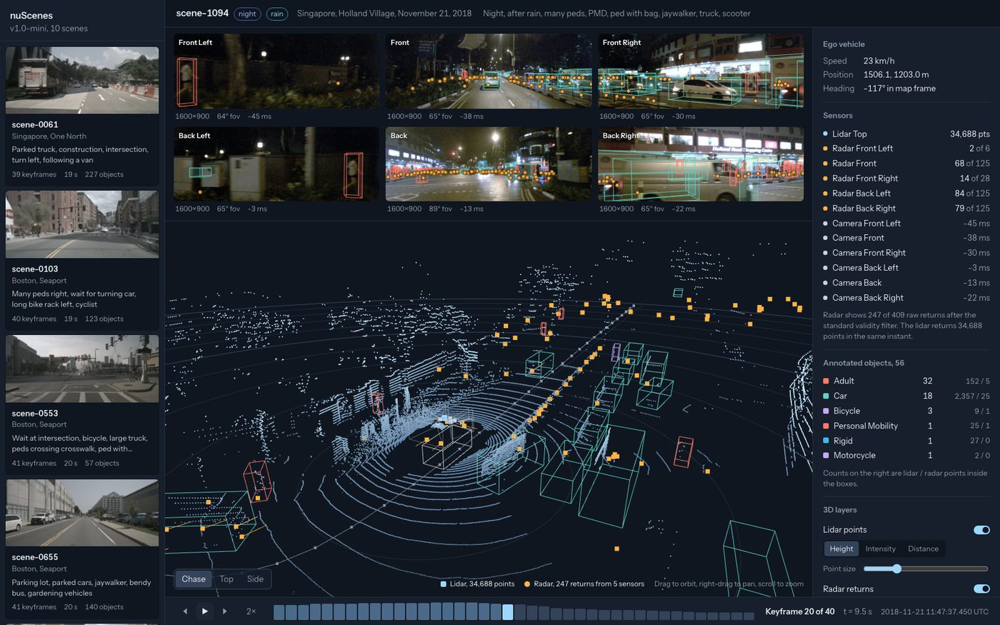
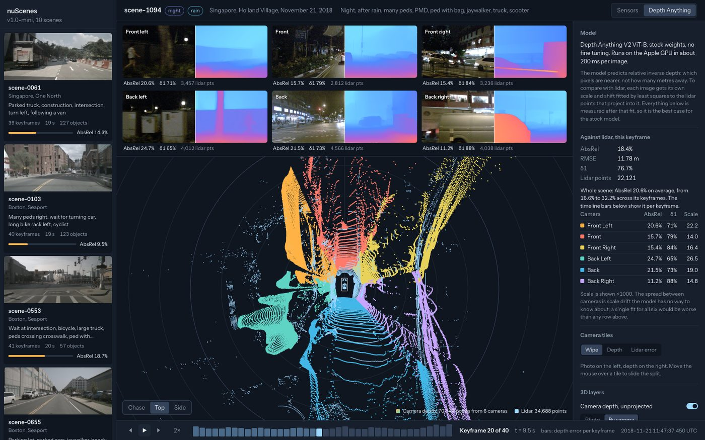
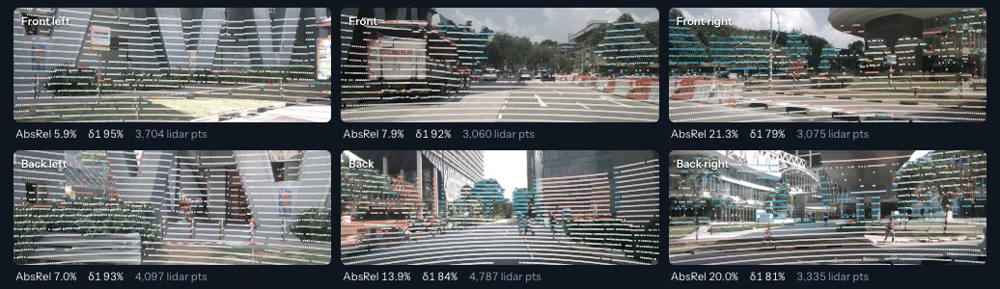
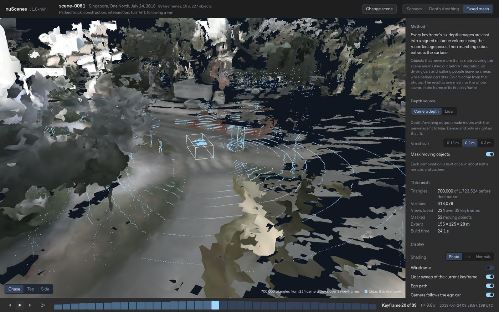
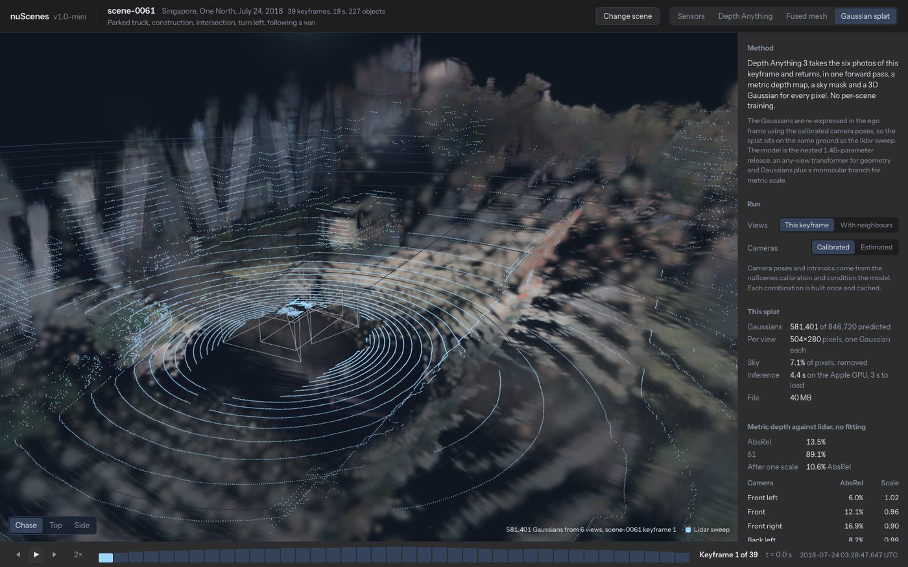

# nuScenes sandbox

A viewer for the nuScenes `v1.0-mini` split. Pick a scene, step through its keyframes, and see every sensor at once: the six cameras, the lidar sweep, the five radars, the annotated 3D boxes, and the path the car drove. 

The project has two sides:


### Data Viewer




The viewer stack, `backend/` and `frontend/`, reads the dataset and precomputed results. Therefore, no models or heavy computations on device are required. 

> All precomputed data is available in the `releases` section and can be downloaded with the provided `make` files.

### Compute Data For New Scenes

Optionally, if you want to run new computations (depth, gaussians, etc.), you can download the corresponding models and use the `compute/` environment.

## Quickstart

### Requirements

>[!NOTE]
> 
> - Python 3.12
> - [uv Python environment](https://docs.astral.sh/uv/)
> - Node 20 (or newer)
> - ~1GB Disc Space


### From Repository Source

```sh
git clone https://github.com/nathanaday/autonomous-vehicle-sandbox.git
cd autonomous-vehicle-sandbox
```

### Provided `make` instructions

```sh
make setup 
```

> `setup` uses `uv`, creates `backend/.venv` and installs Python deps; `npm` installs frontend deps


```sh
make data
```

> Downloads the `NuScenes` data from the repo's releases page

```sh
make backend
```

> Starts the backend server (`FastAPI`)

```sh
make frontend
```

> Starts the frontend server (`vite` dev server) 
> <http://localhost:5173>. 

```sh
make data-depth    # Depth Anything predictions: Depth Anything view
make data-fusion   # fused meshes: Fused mesh view
make data-splat    # Gaussian splats: Gaussian splat view
```

> Downloads the precomputed results that unlock the other three views (depth, fusion, splat, respectively) - note you can run any or all of these depending on what you want to see

```sh
make demo
```

> For a single process instead of two, `make demo` builds the UI and serves it with the API on <http://localhost:8000>.


# Provided Views

## Depth Anything view



The second view shows stock Depth Anything V2 (ViT-B, no fine tuning) run on all
six cameras and puts the result next to the lidar. It is the baseline for
both project directions in `depth-anything-av-application.md`.

- **Camera tiles.** A wipe between photo and depth map, the depth map alone,
  or the lidar points drawn on the photo and colored by how far the model
  misses them: coral too close, blue too far.
- **3D view.** The six depth maps unprojected into the ego frame as one
  colored point cloud, over the lidar sweep. Color it by source camera and
  look from the top to see where neighbouring cameras disagree about scale.
- **Inspector.** AbsRel, RMSE, and δ1 against lidar for the keyframe and per
  camera, plus the whole-scene average.
- **Timeline and scene cards.** In this view the timeline bars show error per
  keyframe and every scene card shows its average error, so day and night
  scenes can be compared at a glance.



The model outputs relative inverse depth, so before any comparison each image
gets its own scale and shift fitted by least squares to the lidar points that
project into it. Everything reported is measured after that fit. That is the
best case for the stock model, and the spread of fitted scales between cameras
of the same keyframe is one of the things a real system would have to resolve.

On the mini split the stock model lands at 9 to 16 percent AbsRel on the
daytime scenes and 20 to 22 percent on the three night scenes.

The predictions come precomputed in the `depth` bundle (see Data) or from
`compute/cli.py depth`, under `data/cache/depth`. The fit to lidar and the
error numbers are computed by the backend per request from the cached
prediction, so they need no model.

## Fused mesh view



The third view fuses a whole scene into one surface. Every keyframe's six
depth images are cast into a truncated signed distance volume with Open3D,
using the recorded ego poses, and marching cubes extracts the mesh. Colors
come from the photos.

- **Depth source.** Camera depth is the Depth Anything output made metric
  with the per-image fit to lidar: dense, and only as right as that fit.
  Lidar is the sweep projected into each camera and filled between beams by
  nearest neighbour: sparse but measured. Comparing the two meshes of the same
  scene shows what in-filling with camera depth buys and what it costs.
- **Moving objects.** Anything whose annotated position changes by more than
  a metre during the scene is masked out of the depth images before
  integration. Parked cars stay, driving cars and pedestrians leave no smear.
- **Driving through it.** The keyframe timeline moves the ego car along the
  mesh, with the current lidar sweep drawn over the fused surface so the
  alignment can be judged by eye. Shading can be photo colors, lit, or
  normals, with a wireframe toggle.

Each combination of scene, source, voxel size and masking is a separate
mesh, decimated to 700 000 triangles, about 30 MB as PLY under
`data/cache/fusion`. The `fusion` bundle carries all twelve combinations for
each of its scenes; `compute/cli.py fusion` makes them, about 25 seconds
each. A combination missing from the cache shows the command that computes
it.

## Gaussian splat view



The fourth view is a Gaussian splat of one keyframe from
[Depth Anything 3](https://github.com/ByteDance-Seed/Depth-Anything-3), with no
per-scene training. The nested 1.4B-parameter model takes the six photos and
returns, in one forward pass, a metric depth map, a sky mask, and one 3D
Gaussian per pixel. On the Apple GPU the pass takes about 5 seconds for six
views and 10 for twelve. The browser renders the result with
[Spark](https://sparkjs.dev/), a Gaussian splat renderer for Three.js.

- **Views.** The six cameras of the keyframe, or eighteen with the neighbouring
  keyframes. More views give the model more overlap and lower the depth error
  in every camera.
- **Cameras.** Calibrated poses and intrinsics condition the model, or the
  model estimates poses itself. The estimated result is anchored at the front
  left camera so the other five show how far the estimate drifts, and the
  inspector reports the rotation and position error per camera.
- **Depth against lidar, no fitting.** Unlike the Depth Anything view, the
  metric branch's scale is used as is. On scene 0061 that gives 13.5 percent
  AbsRel from six views and 10.1 from twelve, next to 12.4 for Depth Anything
  V2 with a per-image lidar fit.
- **Overlays.** The lidar sweep, the camera frustums, the range rings and ego
  car, all in the keyframe's ego frame.

Two implementation notes. The API's final step rescales metric depth by a
similarity fit between predicted and given camera centres; with six cameras a
metre apart that fit is ill-conditioned and halved the depth, so the exporter
skips it and keeps the metric branch's scale. And the Gaussian head's own
positions disagreed with its depth map by a factor of 1.4 to 2.5, so the
exporter keeps the model's rays, colors, opacities and shapes but places every
Gaussian on the metric depth map along calibrated rays.

Splats come precomputed in the `splat` bundle, as 40 MB 3DGS PLY files under
`data/cache/splat` that any 3DGS viewer can open, one per keyframe for the
six-view calibrated setting. The viewer never runs the model: a keyframe
without a splat shows the command that computes it, and playback shows each
keyframe's splat from the cache. `compute/cli.py splat` computes a scene in
about three and a half minutes on an Apple GPU, and its `--views 18` and
`--unposed` options fill the other settings the panel offers. The Depth
Anything 3 checkpoint is CC BY-NC 4.0; the vendored Depth Anything V2 code and
the DA3 code installed by pip are Apache 2.0.


## Data

Everything large lives in `data/`, which git ignores. The dataset and the
results of each feature are separate bundles, and each holds three scenes:
0061 (Singapore, day), 0103 (Boston, day) and 1094 (Singapore, night). The
backend reports which features have results at `/api/features`, and the UI
locks the views whose feature has none and shows the command that fetches
them.

| Bundle | Path | Contents | Size | Unlocks |
|---|---|---|---|---|
| `dataset` | `data/nuscenes/` | The `v1.0-mini` tables and the keyframe files of the three scenes; no sweeps | 0.2 GB | Sensors |
| `depth` | `data/cache/depth/` | Depth Anything output for every keyframe camera image, with per-scene summaries | 0.1 GB | Depth Anything |
| `fusion` | `data/cache/fusion/` | Fused meshes, twelve per scene | 0.7 GB | Fused mesh |
| `splat` | `data/cache/splat/` | Gaussian splats, one per keyframe | 4.0 GB | Gaussian splat |

The `dataset` bundle is required; the backend refuses to start without it.
The tables list all ten scenes of the split, and the backend shows the ones
whose files are on disk, so a full `v1.0-mini` extracted into
`data/nuscenes/` works too and shows all ten. Model checkpoints are not in
any bundle; `scripts/fetch_models.sh` fetches them for the compute side.

The bundles are split into parts under 2 GB on the repository's
[releases page](https://github.com/nathanaday/autonomous-vehicle-sandbox/releases).
`data.manifest` at the repository root records, for each bundle, the release
URL and a SHA-256 for every part and for the joined archive.

**Option 1, the script.** `make data`, `make data-depth`, `make data-fusion`
and `make data-splat` run `scripts/sync_data.sh` for one bundle; `make
data-all` fetches all four. The script downloads the parts listed in
`data.manifest`, verifies each checksum, joins and verifies the archive,
extracts it into `data/`, and checks that the bundle's marker path exists. It
resumes interrupted downloads and skips a bundle that is already installed.
It needs `curl` and `shasum` or `sha256sum`, and free disk of about twice the
bundle's size while it extracts.

**Option 2, by hand.** Download every `av-sandbox-<bundle>.tar.gz.part-*`
file from the release, then:

```sh
cat av-sandbox-dataset.tar.gz.part-* > av-sandbox-dataset.tar.gz
shasum -a 256 av-sandbox-dataset.tar.gz     # compare with the bundle line in data.manifest
mkdir -p data && tar -xzf av-sandbox-dataset.tar.gz -C data
```

**Option 3, from the sources.** Download `v1.0-mini.tar` from
<https://www.nuscenes.org/nuscenes#download> and extract it so that
`data/nuscenes/v1.0-mini/scene.json` exists. Then compute the results with
the compute side, `compute/README.md`.

To publish a bundle after changing its part of `data/`, run `make data-bundle
TAG=data-v3 BUNDLES=splat`, upload the files it writes to `data/bundle/splat/`
to a release with that tag, and commit the updated `data.manifest`. Bundles
not rebuilt keep their lines and their release URL. `SCENES` chooses the
scenes.

`NUSCENES_DATAROOT`, `DEPTH_CACHE`, `FUSION_CACHE` and `SPLAT_CACHE` override
the locations for the backend and the compute CLI alike.


## How it fits together

`backend/app/nuscenes.py` reads the JSON tables directly and does the
geometry. It does not depend on the nuScenes devkit. For each keyframe it
puts every sensor into one frame, the ego vehicle frame at the lidar
timestamp, so the frontend never has to compose transforms:

- Lidar and radar points come back as flat `Float32Array` binaries already in
  that frame. Radar is filtered the way the devkit filters it by default
  (`invalid_state == 0`, `ambig_state == 3`); the inspector shows raw and
  filtered counts side by side.
- Each camera comes with its intrinsics and a `ref_to_cam` matrix that
  accounts for the ego motion between the lidar sweep and the camera exposure.
  The browser projects points into images with those.
- Annotation boxes and the scene trajectory are expressed in the same frame.

`backend/app/main.py` exposes this as JSON and binary endpoints under `/api`,
resizes camera images on request, and serves `frontend/dist` when it exists.

`backend/app/depth.py` wraps the vendored Depth Anything V2 model code
(`backend/app/depth_anything_v2`, Apache 2.0), runs it on the Apple GPU when
available, caches predictions, fits each image to the lidar, and unprojects
the fitted depth into the ego frame.

`backend/app/fusion.py` builds the fused meshes in a background thread with
Open3D's scalable TSDF volume, masks moving objects using the annotation
boxes, and writes binary PLY plus a JSON sidecar with stats and per-keyframe
ego poses in the scene frame.

`compute/` holds everything that runs a model: `depth.py` for Depth Anything
V2, `fusion.py` for the TSDF mesh, `splat_export.py` for Depth Anything 3,
and `cli.py`, which fills the cache for named scenes and loads each model
once. It imports the loader and the cache classes from `backend/app`, so both
sides name files the same way. `backend/app/depth.py`, `fusion.py` and
`splat.py` only read the cache; the backend's environment has no torch.

`frontend/src` is Vue 3 with a small reactive store in `state.ts`. The four
views share the Three.js scaffolding in `composables/useThreeScene.ts`, with
the ego frame used directly as world coordinates, z up. The nuScenes ego
origin is on the road surface. Only one view is mounted at a time so its
WebGL context is released before the next one starts. Camera overlays are
drawn on a 2D canvas over each image.

## What the mini split contains

| | |
|---|---|
| Scenes | 10, about 20 s each, 39 to 41 keyframes at 2 Hz |
| Locations | Boston Seaport, Singapore One North, Queenstown, Holland Village |
| Conditions | 3 night scenes, 1 tagged after rain, the rest clear daytime |
| Cameras | 6 at 1600×900, 12 Hz, about 65° horizontal fov each, 89° for the back camera |
| Lidar | 1 at 20 Hz, 32 beams, about 35 000 points per sweep |
| Radar | 5 at 13 Hz, about 125 raw returns each, 20 to 80 after filtering |
| Annotations | 3D boxes at every keyframe, 23 categories, with per-box lidar and radar point counts |

Only keyframes are shown. The `sweeps/` folder holds the intermediate
frames at full sensor rate; the API does not expose them yet.
