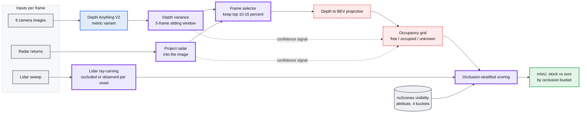
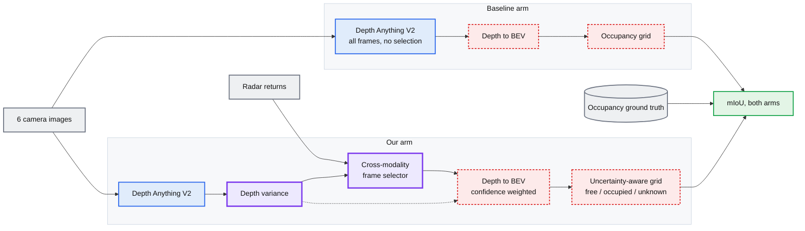
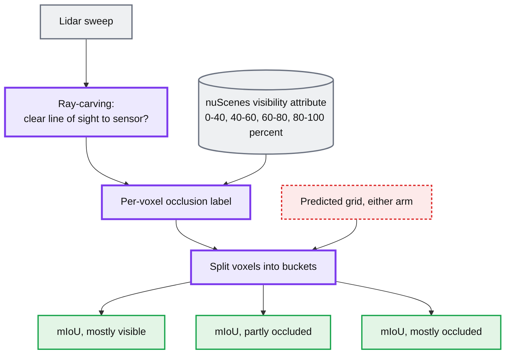
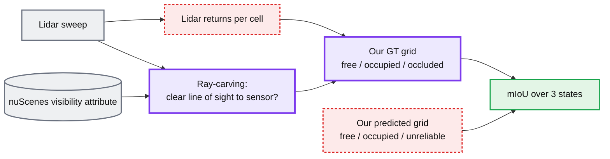

---

## Figure 1. The pipeline based on Google Doc Plan (9-8-2026)

Only one borrowed model appears: Depth Anything V2. Everything between the depth
map and the score is ours. Lidar enters the pipeline only on the scoring side,
for ray-carving, not as a model input.

---

## Figure 2. What the before-and-after compares

The doc's final item is "standard Depth Anything vs our improved Depth Anything."
Both arms have to reach a grid before there is a number to compare.

The baseline arm needs the same depth-to-BEV and grid code as our arm, or the
comparison measures the grid builder instead of the depth model. That code is
one component used twice, not two components.

---

## Figure 3. Where the occlusion contribution attaches

Contribution 4 is not a block in the model. It sits after prediction, on the
scoring side, and it changes how one number becomes several.

The doc says occlusion buckets replace day/night as the primary split, because
buckets pool many objects while weather pools a handful of scenes. Both splits
come out of the same scoring script, so running both costs almost nothing.

Two different things carry the name "occlusion" here. Ray-carving gives a label
per voxel. The nuScenes visibility attribute gives a label per annotated object.
Joining them means deciding what an object-level percentage says about the voxels
inside that object's box.

---

## Figure 4. Where the ground truth comes from

The pipeline does not score against Occ3D. It builds its own labels, because the
grid it predicts has a state Occ3D does not contain.

The doc specifies how ray-carving marks a cell occluded. It does not say what
marks a cell occupied or free in the ground truth. Lidar returns are the obvious
source, so that node is drawn but is not in the doc.

---

## Two decisions this pipeline makes

Neither is stated as a decision in the meeting doc. Both follow from it.

**We construct the grid, we do not predict a labeled one.** Depth goes into
bird's-eye-view cells and each cell gets a state. There is no image encoder, no
lifting of features into voxels, no 3D head, and no training. The grid is the
output of a projection and a threshold rule.

**We bring our own ground truth.** Occ3D labels every nuScenes keyframe with 17
semantic classes and ships visibility masks. Our grid has three states and no
classes, so Occ3D has nothing to compare against a cell we call unreliable. The
ray-carving in Contribution 4 exists to produce labels that match our output.

Both follow from the same choice, so they stand or fall together.

The cost is that no published number is comparable to ours. mIoU over free,
occupied and unreliable is not the mIoU in occupancy papers, which averages over
17 classes. The before-and-after against stock Depth Anything still works, since
both arms use our GT. Nothing outside the project does.

The alternative, a fusion network trained on Occ3D, is in
`route-b-occ3d.md`. It is not what the meeting doc describes.

**BEV Grid States** 

Free and occupied are observations. 

| State | Set by | Meaning |
|---|---|---|
| Free | Depth projection | Nothing here |
| Occupied | Depth projection | Something here |
| Unreliable | Depth variance, radar disagreement | We saw it, we do not trust it |
| Occluded | Lidar ray-carving | We could not see it |

Unreliable is a prediction-side state from Contribution 3. Occluded is a
scoring-side label from Contribution 4. Collapsing them into one "unknown"
would lose the distinction the two contributions are built on.

---

## Component inventory

| Component | Borrowed or ours | Source or note |
|---|---|---|
| Depth Anything V2, metric | Borrowed | Running in the sandbox already |
| Depth variance over a sliding window | Ours | Needs a frame rate; see below |
| Radar projection into the image | Ours | In the sandbox viewer already |
| Cross-modality frame selector | Ours | The threshold rule is hand-tuned |
| Depth to BEV projection | Ours | Not specified in the doc |
| Free / occupied / unknown classifier | Ours | Not specified in the doc |
| Confidence to "unknown" rule | Ours | Not specified in the doc |
| Lidar ray-carving | Ours | Not specified in the doc |
| nuScenes visibility attribute | Borrowed | Ships with the dataset |
| Occlusion-bucketed scoring script | Ours | One script, several rows |

---
