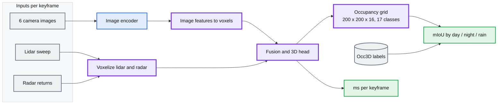

# Route B: fusion network trained on Occ3D

## How it differs from the Google Doc

| | Meeting doc | Route B |
|---|---|---|
| Output | BEV cells, 3 states | 200 x 200 x 16 voxels, 17 classes |
| Ground truth | Ours, from lidar ray-carving | Occ3D, published |
| Trains a model | No | Yes, the fusion head |
| Depth Anything | The subject of the project | One ablation row |
| Comparable to published mIoU | No | Yes |
| Radar | Arbiter in the frame selector | An input to the network |

## What carries over

Contribution 4 carries over unchanged. Occ3D ships camera-visible and occluded
masks, so occlusion-stratified scoring works on Route B without ray-carving, and
the ray-carving is optional extra resolution rather than a dependency.

The depth-variance signal carries over as a per-pixel confidence weight on the
camera-to-voxel lifting, with mIoU reported with and without the weighting. It
does not carry over as a frame selector, because the network needs an output for
every keyframe.

Contribution 3's uncertainty-aware states do not carry over. Occ3D has no
unreliable class.

## Notes

Route B is the version where the radar hypothesis is testable: almost no
published occupancy baseline uses radar as an input, so adding it should help
most in the rain and night splits. That claim needs a network with radar as an
input and a published label set to score against. The meeting doc's pipeline has
neither.

Cost: Route B trains a model, which the meeting doc's pipeline does not, and
training is the part with real compute risk on a course timeline.
