# AV Project Directions V2

Six candidate projects on the nuScenes dataset, in two families. Each one
is a single pipeline: what goes in, what model runs, what comes out, what
number we report. In the diagrams, *borrowed* is released code or data used
as-is; *ours* is what the team writes and trains.

**Terms.**

- **Keyframe.** One labeled moment in a drive, every 0.5 s. A scene is 20 s,
  about 40 keyframes.
- **Lidar / radar.** The laser scanner gives 35,000 points per keyframe.
  The five radars give a few hundred, but work in rain.
- **Occupancy grid.** The space around the car cut into 0.4 m cubes
  (voxels), each marked empty or filled with a class: car, road, tree.
- **Occ3D.** A published label set that gives every nuScenes keyframe its
  occupancy grid. We have it loaded in the viewer.
- **mIoU.** The standard score for occupancy: how well predicted voxels
  overlap the labeled ones, averaged over classes.

---

## What the sandbox taught us

Version 1 assumed we could rebuild a drive as a reliable 3D scene, add
weather, and watch perception degrade. Four attempts say no: lidar alone is
sparse, camera depth only holds from the camera it came from, fusing that
depth into a surface is unusable, and Gaussian splatting has too few views
because the car passes everything once.

| The sensors are sparse | Fused surface from camera depth | Trained splat away from the road |
|---|---|---|
|  |  | 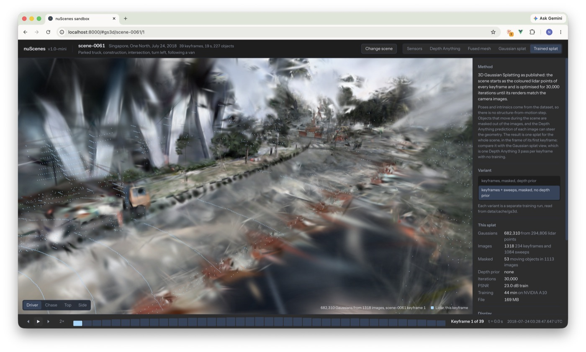 |

Two conclusions.

- **Clear-weather perception is hard enough.** Weather becomes an evaluation
  split (day, night, rain), not the project.
- **The 3D scene is not the goal.** The viewer built intuition. Only Stub F
  still needs it.

What stays fixed: nuScenes, a trained model, one pipeline.

---

## The map

Two families. The first builds an occupancy grid from the sensors and
extends it along four dimensions: more inputs, harder conditions, speed, and
analysis on top of the grid. The second rebuilds the scene for simulation
and extends it with scene analysis and learned infill.

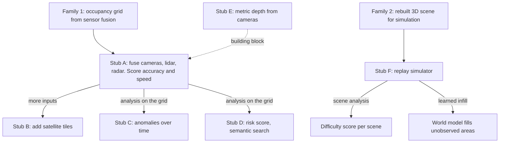

Harder conditions are not a separate stub: every score in family 1 is split
by day, night and rain.

---

## Stub A. Occupancy grid from sensor fusion

Every keyframe, combine the six cameras, the lidar and
the radar into one occupancy grid around the car, and measure what each
sensor adds.

This is the task every self-driving car solves on board. The label already
exists (Occ3D), so the whole loop runs on the mini split today.

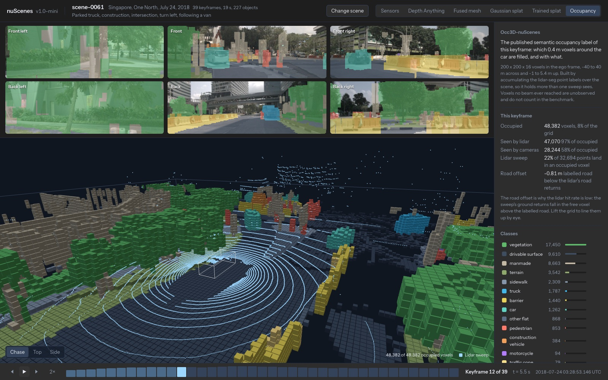

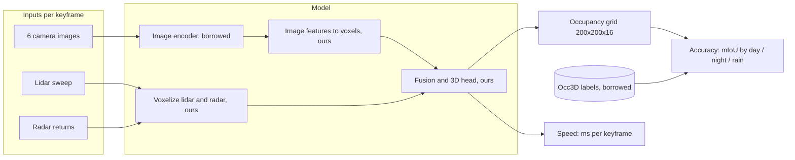

- **Start from.** A published camera-plus-lidar occupancy network. Sze and
  Kunze (arXiv 2403.08748) is the lightweight reference: sparse convolution,
  real-time on nuScenes.
- **Ours.** The fusion block, and radar as an input. No common baseline uses
  radar for occupancy.
- **Baselines.** Lidar only, camera only, from the same scoring code.
- **Result.** One table: mIoU for lidar, camera, camera + lidar, camera +
  lidar + radar, split by day, night, rain, with the time per keyframe next
  to each row. Real time is 500 ms per keyframe, and a lidar sweep every
  50 ms is the harder target.
- **Risk.** Compute. Train on a few hundred scenes of the 700, and say so.

---

## Stub B. Satellite-assisted occupancy

Stub A plus a satellite tile of the road around the car,
to fill in what the cameras cannot see behind a bus or around a corner.

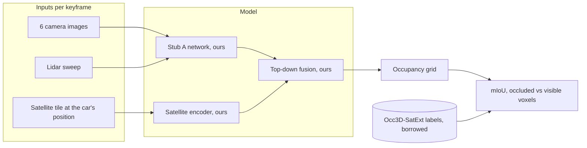

- **Data.** Occ3D-nuScenes-SatExt on Hugging Face
  (`chenchen235/Occ3D_nuScenes_SatExt`): a Google Earth tile per keyframe.
  Paper: SA-Occ (arXiv 2503.16399). Tiles are from 2024, drives from 2019.
- **Result.** Stub A's table with one more row. Does the tile fix the voxels
  the cameras could not see?
- **Risk.** The paper already did this. Take it as Stub A's stretch goal,
  not on its own.

---

## Stub C. Anomaly detection over time

Learn how each kind of object normally moves between
keyframes, then point out the objects that do something the model did not expect.

A barrier never moves. A pedestrian walks. A model that has seen enough
keyframe pairs learns those rules. The output is a list of "look at this"
moments per scene, as 3D boxes with a score.

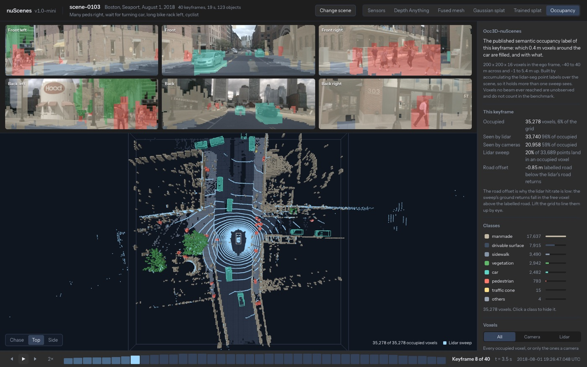

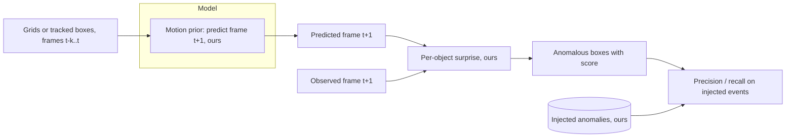

- **Model.** Either a small network that predicts the next occupancy grid
  from the last few, or a per-class motion model on the tracked boxes. The
  box version is simpler and needs no grid.
- **Inputs.** The Occ3D labels or the boxes directly, so this does not wait
  on Stub A. Feeding Stub A's predictions in is the final integration.
- **Result.** nuScenes has no anomaly labels, so we make them: move a
  barrier, teleport a pedestrian, reverse a car in held-out scenes, then
  report precision and recall. Then show the top real detections and judge
  them by eye.
- **Risk.** Keyframes are 0.5 s apart, so a car moves 7 m between labels
  and "normal" is loose. The injected anomalies set the score, so they must
  be varied and documented.

---

## Stub D. Risk score and semantic search over the grid

Once every keyframe has a grid, ask two questions of it: how risky is this
moment, and where else in the dataset does this situation occur.

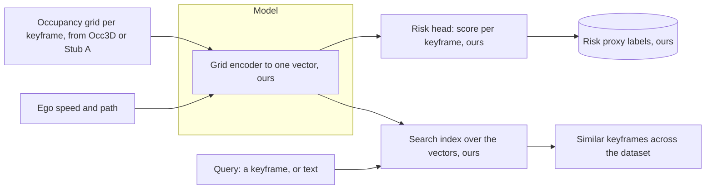

- **Risk score.** nuScenes has no risk label, so we define a proxy from the
  boxes: time to collision along the ego path, pedestrians within a few
  meters of it, and how much of the path the cameras cannot see. The model
  learns to predict the proxy from the grid alone. The result is a risk
  curve per scene, and the top moments of the dataset to look at.
- **Semantic search.** The same encoder gives one vector per keyframe. Pick a
  keyframe and get the nearest ones from other scenes: same layout, same
  crowding, same occlusion. Text queries need a second encoder trained to
  match captions to grids; nuScenes has one description per scene, which is
  thin, so start with keyframe-to-keyframe search.
- **Result.** For risk, agreement with the proxy on held-out scenes and a
  page of the highest-scoring moments. For search, a page of query keyframes
  next to their five nearest neighbours, judged by eye.
- **Risk.** The proxy defines the score, so a weak proxy gives a meaningless
  number. Keep the proxy simple and show it next to the prediction.

---

## Stub E. Metric depth from cameras, supervised by lidar

Fine-tune Depth Anything on nuScenes so it outputs
distances in meters directly, and report how it holds up at night and in
rain.

Today the stock model needs a per-image fit to lidar before its output means
anything in meters. Even then it misses by 9 to 16 percent by day and 20 to
22 percent at night.

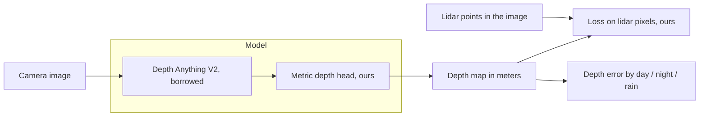

- **Optional.** Radar points as a second input, since radar works in rain.
- **Baseline.** Stock Depth Anything with the per-image fit, already in the
  viewer.
- **Result.** The existing error table with one more row. Watch the night
  column.
- **Risk.** Low novelty. A sure result and a clean score, but a small
  project.

---

## Stub F. Rebuilt scene as a replay simulator (fork)

Rebuild a drive as a 3D scene, render views the car
never saw, add weather, and find when a detector fails.

Kept as a branch, not a recommendation. The rebuilt scene holds up from the
driver's seat and falls apart from anywhere else, and nothing in the pipeline
learns.

| From the road | Away from the road |
|---|---|
| 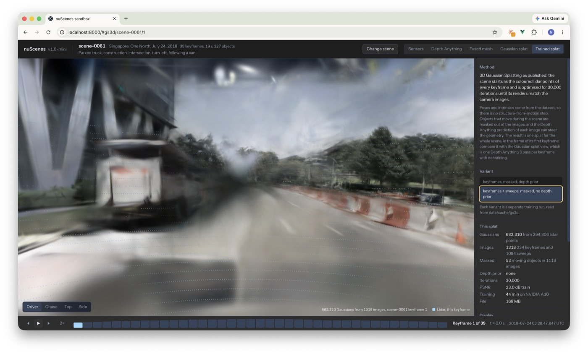 |  |

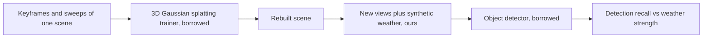

- **What would make it a project.** A learned part: a reconstruction model
  that generalizes across scenes, or a detector trained on the rendered
  weather and tested on real rain. Both are large.
- **Extension: difficulty score.** The risk score of Stub D, computed on the
  rebuilt scene instead of the grid, so a whole drive gets a difficulty
  rating that a simulator could sort by.
- **Extension: fill the unobserved areas.** The rebuilt scene is empty
  wherever the car never looked. A world model trained on many scenes could
  fill those areas in. Note that family 1 already does this in a simpler
  form: predicting occupancy in voxels the sensors did not observe is
  scene completion, and Occ3D scores it.

---

## Comparison

| | A. Fusion occupancy | B. Satellite | C. Anomalies | D. Risk and search | E. Metric depth | F. Simulator |
|---|---|---|---|---|---|---|
| Family | 1 | 1 | 1 | 1 | 1 | 2 |
| Trains a model | yes | yes | yes | yes | yes | not by default |
| Labels | Occ3D, in the viewer | Occ3D-SatExt | we make them | we define a proxy | lidar | none |
| Novelty | radar in fusion | low, paper exists | moderate | moderate | low | moderate |
| Compute | high | high | low | low | medium | high |
| Depends on | nothing | A | nothing | nothing | nothing | nothing |

**Recommendation.** A as the main pipeline, with C or D as the contribution
on top. E is the fallback if A's compute does not work out. B is A's stretch
goal. F is a fork.

